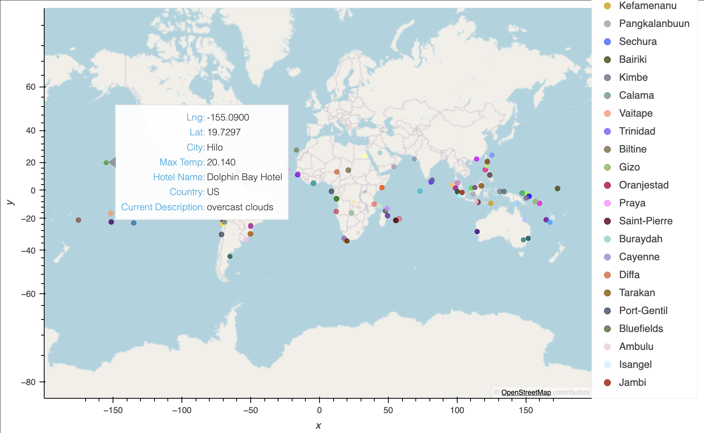
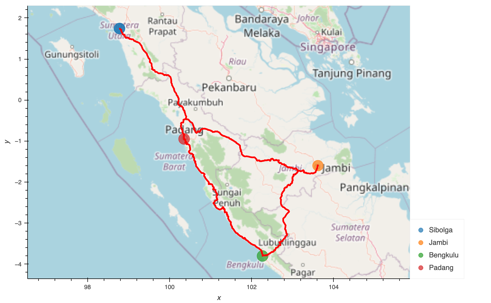

# World Weather Analysis

## Overview of Project

### Purpose

The purpose of this project is to create a simple random vacation based on the current weather of random cities around the world.

## Database Creation

[weatherdatabase.ipynb](weather_database/weather_database.ipynb)

### Generating Random Cities

I started by creating a random **longitude** and **latitude** generator.

```python
lats = np.random.uniform(low= -90, high= 90, size= 2000)
lngs = np.random.uniform(low= -180, high= 180, size= 2000)
lat_lngs = zip(lats, lngs)
```

Using the generated coordinates, I used the `citipy` library to collect the names of the nearest cities and discarding duplicates. The generator returned a list of 733 cities.

### Collecting City Information

Looping through the list of cities, each city was sent through `requests.get()` using **OpenWeatherMap's API** to request each city's:
- Latitude
- Longitude
- Maximum Temperature for the day (Celcius)
- Humidity
- Cloudiness
- Wind Speed
- Country Code
- Weather Description

With this data stored in a CSV file, we were done generating our database for the project.

## Determining Vacation City Candidates

[vacation_search.ipynb](vacation_search/vacation_search.ipynb)

### Filtering Out Unwanted Cities

1. The first major filter applied is based on the input of the user, as it asks for the minimum and maximum ideal temperature for vacation. A new data frame is created with cities that had a **Maximum Temperature** within this range.

2. The second major filter applied is based on cities with a hotel within 5000m of the city's latitude and longitude coordinates. To do this, I looped through the temperature-filtered data frame and used **Geoapify's API** to request this information.  Any city where a hotel couldn't be found through Geoapify's API was discarded from the data frame.

### Mapping the Vacation City Candidates

Using `hvplot`, I plotted every city on a map.



As can be seen by the screenshot of the map, hovering over a city displays its:
- Latitude
- Longitude
- Name
- Max Temp
- Hotel Name
- Country Code
- Weather Description

## Vacation Itinerary

[vacation_itinerary.ipynb](vacation_itinerary/vacation_itinerary.ipynb)

### Deciding on a Location

After zooming into the map and trying to find 4 cities in the same country and within driving distance, I found these cities in Indonesia:
- Sibolga
- Jambi
- Bengkulu
- Padang


### Creating a Route Between Cities

The driving order between them would be: <br>
Sibolga -> Jambi -> Bengkulu -> Padang -> Sibolga <br>  

Using **Geoapify's API** once more, I requested driving waypoint information between each city's coordinates. Once I had that information collected, I used the `geoviews` library to create a path plot using all of the waypoint coordinates. I then laid that path over an `hvplot` map of the 4 cities to show the route to drive between the 4 of them. <br> <br>

**PACK YOUR BAGS!**




## Conclusion

### Positives About This Project

- It can be completely different every time it is run. The randomization of the initial cities is a great way to increase the spontaneous nature of this project.
- It is dependent on wether the weather is nice or not, creating another variability in the projects output. This also includes the variability that comes with seasonal changes in weather.
- OpenWeatherMaps and Geoapify are fantastic tools for Geocoding, and the surface of their capabilities were barely scratched.

### Room for Improvement

- Travel expenses could be taken into consideration.
- Checking to see if any of the cities close to one another has an airport would be fantastic to add.
- Having the program filter by weather on days coming up would be amazing. Currently, it only picks cities based on the weather the moment the `weather_database` is created.
- The filter to remove cities without a hotel near the city's latitude and longitude coordinates could be broadened to search within city limits instead.
